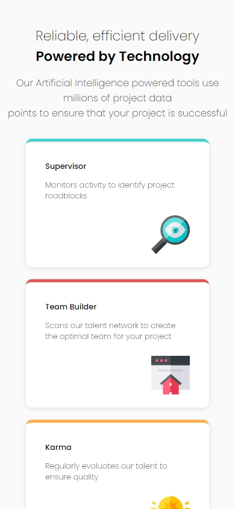
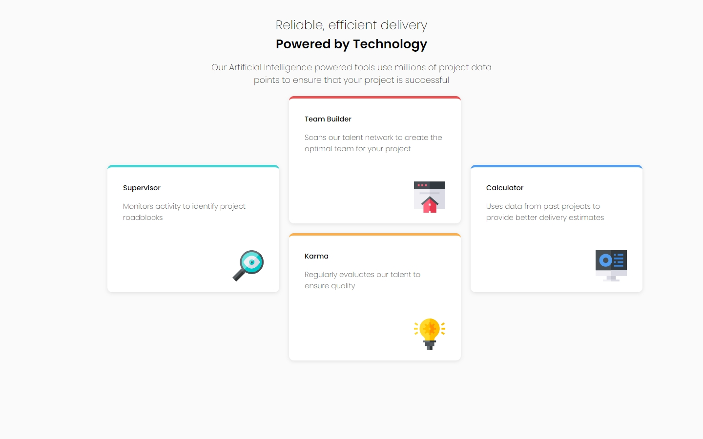
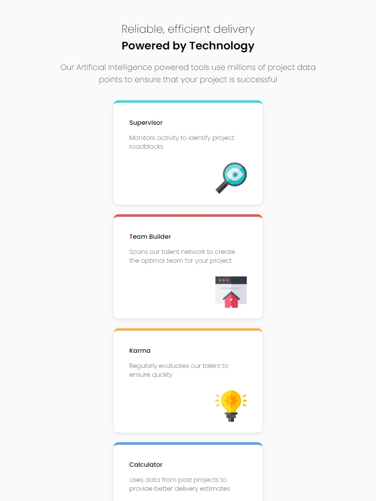

# Beautiful Four Cards

This is a solution to the Beautiful Four Cards Grid Solution built with vanilla HTML and styled with Sass

## Table of contents

- [Beautiful Four Cards](#beautiful-four-cards)
  - [Table of contents](#table-of-contents)
    - [The challenge](#the-challenge)
    - [Screenshot](#screenshot)
    - [Built with](#built-with)
  - [Author](#author)

### The challenge

Users should be able to:

- View the optimal layout depending on their device's screen size
- Responsive across devices

### Screenshot

### Built with

- Semantic HTML5 markup
- CSS custom properties
- Flexbox
- [Syntatically Awesome Style Sheets](https://sass-lang.com/) - For styles

## Author

- Website - [Tunde Sanusi](https://www.tundesanusi.vercel.app)
- Github - [@tuhamworld](https://www.github.com/tuhamworld)
- Twitter - [@tuhamworld](https://www.twitter.com/tuhamworld)