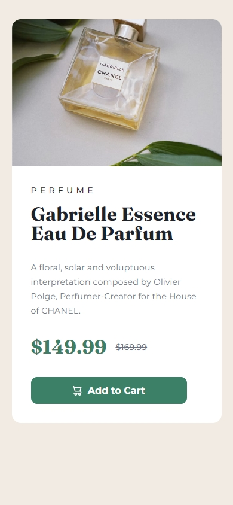

# Product preview card

This is a solution to the Product preview card component built with vanilla HTML and styled with Sass

## Table of contents

- [Product preview card](#product-preview-card)
  - [Table of contents](#table-of-contents)
  - [Overview](#overview)
    - [The challenge](#the-challenge)
    - [Screenshot](#screenshot)
    - [Built with](#built-with)
  - [Author](#author)
  - [Acknowledgments](#acknowledgments)

**Note: Delete this note and update the table of contents based on what sections you keep.**

## Overview

### The challenge

Users should be able to:

- View the optimal layout depending on their device's screen size
- See hover and focus states for interactive elements

### Screenshot

### Built with

- Semantic HTML5 markup
- CSS custom properties
- Flexbox
- [Syntatically Awesome Style Sheets](https://sass-lang.com/) - For styles

## Author

- Website - [Tunde Sanusi](https://www.tundesanusi.vercel.app)
- Github - [@tuhamworld](https://www.github.com/tuhamworld)
- Twitter - [@tuhamworld](https://www.twitter.com/tuhamworld)

## Acknowledgments

I'd like to acknowledge [DevCareer](https://github.com/devcareer/sass-architecture) for the introduction to Sass during the DTCP program
