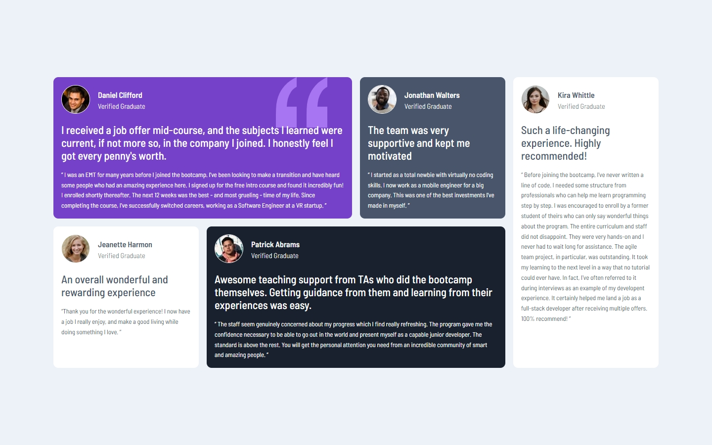

# Testimonials Grid section

## Table of contents

- [Testimonials Grid section](#testimonials-grid-section)
  - [Table of contents](#table-of-contents)
  - [Overview](#overview)
    - [The challenge](#the-challenge)
    - [Screenshot](#screenshot)
    - [Built with](#built-with)
  - [Author](#author)

## Overview

### The challenge

Users should be able to:

- View the optimal layout for the site depending on their device's screen size

### Screenshot

;
;

### Built with

- Semantic HTML5 markup
- CSS custom properties
- Flexbox
- CSS Grid
- Mobile-responsiveness workflow
- [Syntatically Awesome Style Sheets](https://sass-lang.com/) - Sass

## Author

- Website - [Tunde Sanusi](https://www.tundesanusi.vercel.app)
- Github - [@tuhamworld](https://www.github.com/tuhamworld)
- Twitter - [@tuhamworld](https://www.twitter.com/tuhamworld)
